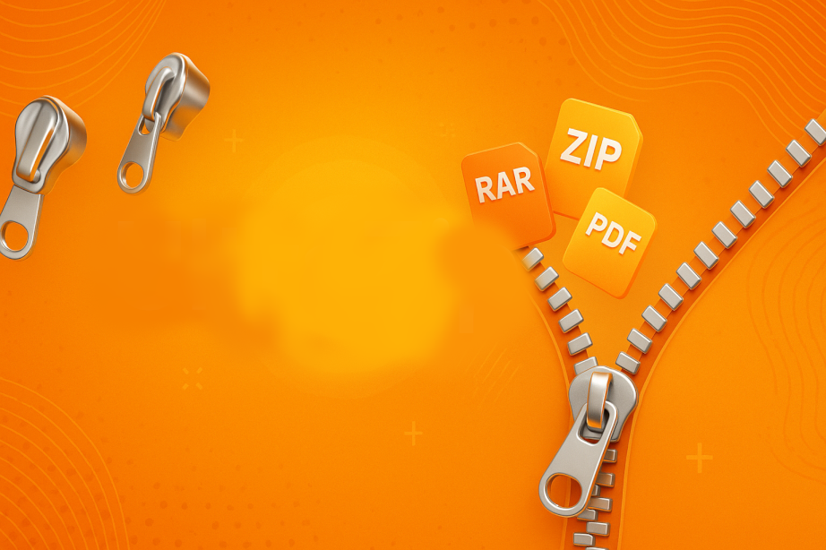

# UltraZip
UltraZip

 

**🔧 Choose Your Zip Mode**

Select how you want to compress your data:

* **Zip File**: Use this mode to compress one or multiple individual files into a single .zip archive.
* **Zip Folder**: Use this mode to compress an entire folder, including all its contents and subfolders.

Just click the option that fits your need and start zipping!

---
